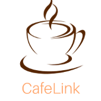
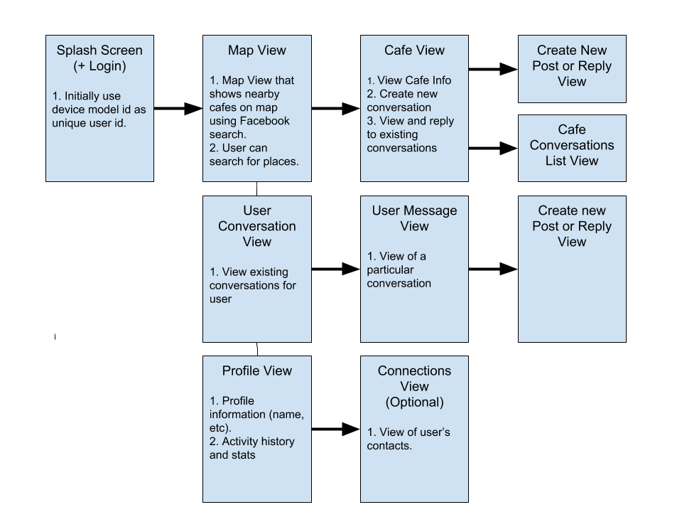

    

Cafelink
---
Coffee-powered Networking

Android App for connecting with other entrepreneurs at nearby cafes.

Initially built for the <a href="https://devcommunitychallenge.devpost.com">Facebook Developer Circles Challenge</a> as an app to bring communities closer together.

### Concept

Cafes are a very common location for people to do work - often in silos and on individual projects; however, they could also be a great location to potentially network with other builders. 

Cafelink is a novel app for connecting people locally around projects by meeting and discussing at local cafe locations - powered by facebook search.

### Dev Setup

Add a the following variable (using your mapbox api key) to your `gradle.properties` file:

<pre>
    Cafelink_MapboxKey="XXXXXXXX"
</pre>

### App User Flow

1. Users can search for nearby cafes and see current discussions.
2. Users can participate in existing discussions (conversations) or start their own conversation threads at a particular cafe.
3. Users can see a list of messages they've received on their posts as well as reply.
4. Users can manage their contacts and view their activity on the Cafelink app.

